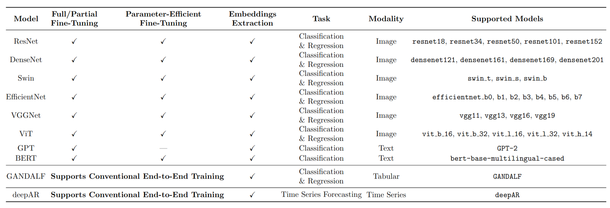

Welcome to Deeptune's documentation!
===================================

**DeepTune** is a full compatible tool package to automate Computer Vision, Natural Language Processing, Tabular, and Time Series state-of-the-art deep learning algorithms for multimodal applications on image, text, tabular, and time series datasets. The library is designed for use in different applied machine learning domains, including but not limited to medical imaging, natural language understanding, time series analysis, providing users with powerful, ready-to-use CLI tool that unlock the full potential of their case studies through just a one simple command.

**DeepTune** is primarily presented for undergraduate and graduate computer science students community at St. Francis Xavier University (StFX) in Antigonish, Nova Scotia, Canada. We aspire to seeing this software adopted broadly across the computer science research community all over the world.

Check out the :doc:`guides/install` section for further information, including how to install the library.

GitHub repository can be accessed through the following link: https://github.com/moayadeldin/deeptune

.. note::

   This project is under active development.

Main Features
-------------

- Fine-tuning state-of-the-art Computer Vision algorithms (ResNet, DenseNet, etc.) for image classification.
- Fine-tuning state-of-the-art NLP (BERT, GPT-2) algorithms for text classification.
- End-to-end training for tabular and time-series algorithms.
- Enabling parameter-efficient fine-tuning of state-of-the-art vision and NLP models using PEFT with LoRA, reducing computational cost while maintaining high performance.
- Leveraging fine-tuned and pretrained state-of-the-art vision and language models to generate robust knowledge representations for downstream visual and textual tasks.

`DeepTune` Supported Models
----------------------

`DeepTune` Running Demos
------------------------------

The following videos demonstratee how to use **DeepTune** for medical image classification and sentiment analysis by fine-tuning ResNet18, and Multilingual BERT models without and with PEFT respectively. The singleline command automates running the entire pipeline including loading the raw images, dataset splitting, training, evaluation, and embeddings extraction.

1. **Images Demo.** The data sample used in this demo is a subset of the Chest X-Ray Images (Pneumonia) dataset available at: `Chest X-Ray dataset <https://www.kaggle.com/datasets/paultimothymooney/chest-xray-pneumonia>`_.

.. raw:: html

    <video width="640" controls>
        <source src="_static/deeptune_images_demo.mp4" type="video/mp4">
        Your browser does not support the video tag.
    </video>

2. **Text Demo.** The data sample used in this demo is a subset of the Twitter Sentiment Analysis dataset available at: `Twitter Sentiment Analysis dataset <https://www.kaggle.com/datasets/yasserh/twitter-tweets-sentiment-dataset>`_.

.. raw:: html

    <video width="640" controls>
        <source src="_static/deeptune_text_demo.mp4" type="video/mp4">
        Your browser does not support the video tag.
    </video>

The tabular and time-series video demos are available in the :doc:`guides/demos` section.

Contents
--------

.. toctree::
   :maxdepth: 2
   :caption: User Guide

   guides/install
   guides/preface
   guides/demos

.. toctree::
   :maxdepth: 2
   :caption: Quick Start

   tutorials/firstrun

   

.. toctree::
   :maxdepth: 2
   :caption: Functionalities

   functionalities/handlers/split
   functionalities/handlers/training
   functionalities/handlers/evaluation
   functionalities/handlers/embedding
   functionalities/handlers/dfanalyze

Acknowledgements
----------------
This software package was developed as part of work done by Moayadeldin Hussain at Medical Imaging Bioinformatics lab under the supervision of Jacob Levman at St. Francis Xavier Univeristy, Nova Scotia, Canada.

Thanks to Xuchen for providing their parameter-efficient fine-tuned Swin implementation `SwinTransformerWithPEFT <https://github.com/XuchenGuo/SwinTransformerWithPEFT>`_.

Citation
--------
If you find **DeepTune** useful in your research, support us with a star 💫 on the GitHub repo.

If you make use of **DeepTune**, please cite the repository as follows:

.. code-block:: bibtex

   @software{DeepTune,
   author  = {Moayadeldin Hussain, John Kendall and Jacob Levman},
   title   = {DeepTune: Cutting-edge Tool automating state-of-the-art deep learning models for cross-modal applications},
   year = {2025},
   url = {https://github.com/moayadeldin/deeptune},
   version = {1.0.0}
   }
